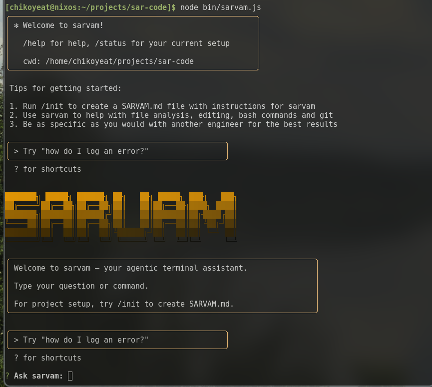

# sar-code
claude code but for sarvam with less functionality, i am trying my best to implement code and directory manipulation but since i don't like javascript that much it will take some time.

## License

All code under this repository is licensed under the [MIT LICENSE](./LICENSE.md)
license.
